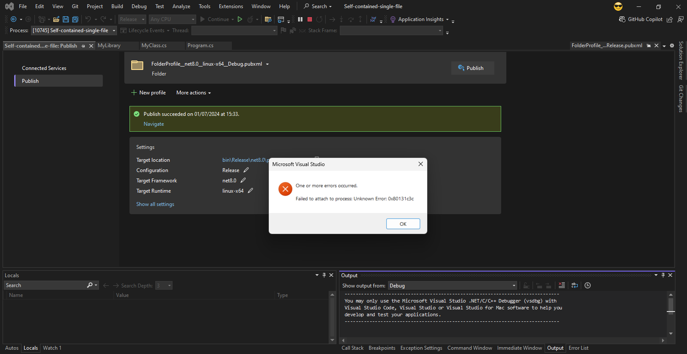

# Self-contained-single-file

With the win-x64 target it is possible to attach to the debugger.

With the linux-x64 or osx-x64 targets, the error "Failed to attach to process: Unknown Error: 0x80131c3c" is obtained when attaching to the debugger.

To test it, right-click on the "Self-contained-single-file" project and then click on "Publish...".
Create new profiles for win-64, linux-x64 and osx-x64 with the deployment mode as "Self-contained" and in "File publish options" activate "Produce single file". After creating the profiles, select the profile targeting linux-x64 and click Publish. Using WSL navigate to "cd /Self-contained-single-file/Self-contained-single-file/bin/Debug/net8.0/publish/linux-x64/" and run "./Self-contained-single- filet". In Visual Studio 2022 click Debug->Attach to Process. Select WSL and ./Self-contained-single-file and click Attach. You will see the error "Failed to attach to process: Unknown Error: 0x80131c3c".